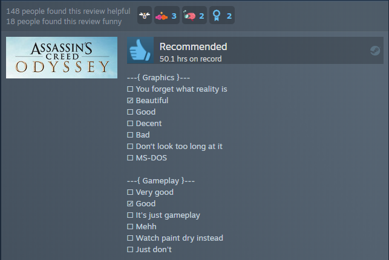

#### Traducción del modelo original en inglés creado por: Vojtěch Struhár - https://github.com/VojtaStruhar

# Steam Review Template

Esta es una herramienta para simplificar la creación de reseñas copy-pasta que son algo populares en Steam. Las categorías y opciones no son propias, solo las copié de algún lado.
Hay algunas variaciones menores en algunas de las opciones, pero este es el resumen típico. En este caso es la versión en español.

This is a tool to simplify the creation of copy-pasta reviews that are somewhat popular on Steam. The categories and options are not from my head, I just copied them from somewhere. There are some minor variations on some of the options, but this is the typical rundown. In this case it is the Spanish version.



## Usage

Simplemente marque todas las casillas que desee, el resultado debería verse así:

```
---{ PC Requirements }---
☐ Check if you can run paint
☐ Potato
☐ Decent
☐ Fast
☑ Rich boi
☐ Ask NASA if they have a spare computer
```

Se generará con una línea en la parte inferior que me da crédito. Te agradecería que lo dejaras ahí, pero no tienes por qué hacerlo.:)
